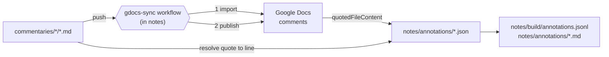

# Commentaries ↔ Google Docs ↔ notes — design

Why this is built the way it is. Reading happens in the Google Docs app;
notes are written there as comments; the `notes` repo is where they come to
rest. For the conventions that bind an agent working in `synthesis/`, see
[synthesis/CLAUDE.md](../synthesis/CLAUDE.md), whose locator scheme and
staleness discipline this design reuses rather than reinvents.

Status: design only. Nothing here is implemented. The implementation belongs
in `faultynode/notes`; this file lives here until that repo is scaffolded,
and should move to `notes/docs/` when it is.

---

## 1. The problem

The commentaries are read on a phone and on Windows, and the reading
produces notes that currently have nowhere to go. Two constraints shape
every decision below.

**Google Docs is a good reading and commenting surface and a bad store.**
The Docs app handles long documents well, works on both devices, and its
comment UI is the fastest way to attach a thought to a passage while
reading. But a Doc is a copy. The commentary in `commentaries/<author>/` is
the thing that is versioned, published to WordPress and GitHub Pages, and
cited by `synthesis/`. Nothing may flow from the Doc back into the
commentary text.

**A comment knows its passage; it does not know its line.** The Drive API
returns each comment's `quotedFileContent.value` — the exact text the
comment was attached to — but nothing that identifies a position in the
markdown file the Doc was converted from. Line numbers have to be
recovered, and the recovery has to be honest about when it fails.

## 2. The invariant

> A note carries the verbatim text it was attached to, and a script finds
> that text in the commentary file.

This is [synthesis-design.md](synthesis-design.md) §2 with the claim removed
and the note put in its place. Everything downstream follows from it: the
quote is what makes a note resolvable, so a note whose quote cannot be found
is a reported failure, never a silently relocated note.

The corollary: **the quote is the anchor of record, and the line number is a
derived hint.** Doc ids, comment ids and line numbers are all regenerable
pointers. The quote and the note text are not.

## 3. Architecture

One workflow, living in `notes`, owns both directions. It runs on a
`repository_dispatch` from a push to `commentaries` and on a six-hourly
cron. Its order is fixed and is the safety property of the whole design:
**import first, publish second.**

## 4. Data model

### The annotation record

`notes/annotations/<commentary-slug>.json`, one file per commentary, an
array of records keyed by `comment_id`.

| Field | Source | Notes |
|---|---|---|
| `comment_id`, `doc_id` | Drive | Identity. A record is updated in place, never duplicated. |
| `created`, `modified`, `author` | Drive | |
| `note` | Drive `content` | What you wrote. Never rewritten by a script. |
| `replies[]` | Drive | Your own follow-ups; same treatment. |
| `quote` | Drive `quotedFileContent.value` | The anchor. Verbatim, never normalized on disk. |
| `resolved_in_docs` | Drive | A resolved comment is still a note. |
| `commentary` | manifest | Slug, from `docs-manifest.json`. |
| `locator` | resolution | `<slug>#<section-id>`, the synthesis scheme (D1). |
| `line_start`, `line_end` | resolution | Hints. Recomputed every run. |
| `occurrences` | resolution | How many times the quote appears in the file. |
| `status` | resolution | `resolved` · `ambiguous` · `drifted` · `deleted_in_docs` |
| `source_sha256` | repo | Digest of the commentary at resolution time. |

### Layout

    notes/
      annotations/<slug>.json      imported; canonical; never hand-edited
      annotations/<slug>.md        generated view, for reading in Obsidian
      docs-manifest.json           generated: slug to doc id(s), published digest
      build/annotations.jsonl      generated: one record per line, for machines
      scripts/gdocs_publish.py
      scripts/gdocs_import.py
      scripts/resolve.py
      .github/workflows/gdocs-sync.yml

| Authored — edit these | Imported — never hand-edit | Generated — never edit |
|---|---|---|
| `scripts/*.py` | `annotations/*.json` | `annotations/*.md` |
| `.github/workflows/*` | | `docs-manifest.json` |
| `docs/*.md` | | `build/annotations.jsonl` |

The middle column is new against `synthesis/`: these records are authored,
but authored in Google Docs. A script may add or correct resolution fields;
it may never touch `note`, `quote` or `replies`.

## 5. Resolution: from a quote to a line

1. Read the commentary file from the repo — never the Doc. The Doc is a
   lossy copy (D6).
2. Build a normalized projection of the file with an index map back to line
   numbers. Normalization is `synthesislib.normalize_quote`: NFKC, quote and
   dash folding, emphasis marks stripped, whitespace collapsed. This is what
   absorbs the differences Docs introduces — curly quotes, `**bold**`
   rendered as bold, wrapped lines rejoined.
3. Normalize the comment's `quote` the same way and search the projection.
4. Count the matches:
   - **one match** — `status: resolved`; record `line_start`, `line_end`,
     and the enclosing `section_id` from `synthesis/corpus.json`.
   - **none** — `status: drifted`. The passage has been edited or removed
     since the comment was written. Reported, never guessed at.
   - **more than one** — `status: ambiguous`. Every candidate line is
     recorded and the note is listed for a human decision.
5. Record `source_sha256`. Resolution re-runs on every sync, so a `drifted`
   note can return to `resolved` when the text is restored, and a `resolved`
   note can drift later.

## 6. Design decisions

### D1 · The locator is the synthesis locator

`<commentary-slug>#<section-id>`, minted by `section_id()` in
[synthesislib.py](../scripts/synthesislib.py). A second id scheme is a
permanent cost, and this one already addresses every commentary in
`synthesis/extractions/` and the seven ledgers. A note and an extraction
unit that point at the same section say so identically.

### D2 · Import before publish, always

Republishing replaces a Doc's body, which orphans every comment anchored to
the replaced text. So the workflow imports first and publishes second, in
one job, and refuses to publish any Doc holding comment ids absent from
`annotations/`. A single workflow in a single repo owns this ordering;
splitting it across repos would make it a race.

### D3 · Publish is a full replace in v1; delta is the extension point

`files.update` with a `text/markdown` media body and a Google Doc target
mime type lets Drive do the conversion. It replaces the whole body. The
alternative — diffing and applying `documents.batchUpdate` ranges — keeps
the anchors of comments on untouched text, but `insertText` does not
interpret markdown, so every inserted heading needs a follow-up
`updateParagraphStyle`. Given D2, full replace loses nothing that has been
imported. Delta becomes worthwhile only if commentaries start changing
faster than the sync runs.

### D4 · A Doc is disposable; a comment is not

Edits typed into a Doc's body are discarded on the next publish, silently
and by design. The commentary is the source of truth and the Doc is a
rendering of it. Only comments survive a republish — by being imported
first, not by surviving in Docs.

### D5 · Notes are never written back as comments

The Drive API accepts an `anchor` on `comments.create`, but Google Docs
renders API-created comments as unanchored regardless, so a restored note
would sit in the sidebar detached from its passage. Rendering notes back
into the Doc as generated footnotes, positioned by searching for each
quote, is a real option and is deferred to Phase 3.

### D6 · Resolution runs against the repo, never the Doc

Markdown-to-Docs conversion is lossy: HTML comments, exact whitespace and
any construct without a Docs equivalent do not survive. The Doc is good
enough to read and to select text in; it is not evidence of what the file
says. Every line number comes from the file in `commentaries/`.

### D7 · Two commentaries must be split

Google Docs caps a document at roughly one million characters. Of the 55
markdown files in scope, two exceed it:

| File | Characters |
|---|---|
| `henry-the-essence-of-manifestation-commentary.md` | 1,781,598 |
| `heidegger-sein-und-zeit-commentary.md` | 1,618,462 |

These publish as multiple part-Docs split at `##` boundaries, never
mid-section, with the split recorded in `docs-manifest.json`. Resolution is
unaffected: a comment's quote is searched in the whole commentary file, and
the part it came from is only a hint. The 811k-character Ideas I commentary
is the warning line — the splitter applies at 900k so a file crossing the
limit is handled before it fails.

### D8 · Auth is an OAuth refresh token, not a service account

Service accounts have no Drive storage quota, and a personal Google account
has no Shared Drive to give them one, so `files.create` fails outright. The
workflow holds `GOOGLE_CLIENT_ID`, `GOOGLE_CLIENT_SECRET` and
`GOOGLE_REFRESH_TOKEN` as secrets in `notes` and exchanges them at run time.
The Docs are then owned by the reading account, which is also the account
whose comments are being imported.

### D9 · Identity is `appProperties`, not the title

Each Doc carries `appProperties: {src, part, published_sha256}`. Lookup is
by `src`, so a renamed Doc still updates in place and a re-run never creates
a second copy. `published_sha256` makes the publish step a no-op when the
commentary has not changed — the trigger is a new version, not a push.

### D10 · Notes are orientation, never evidence

An annotation may ground the reading queue and tell a later pass where to
look. It may never be the source of a `claim`, a `quote` or a date in
`synthesis/`. This is the status `lexicon.json` already has
([synthesis/CLAUDE.md](../synthesis/CLAUDE.md) rule 9), for the same reason:
these are the reader's own judgements, which the extraction rules exist to
keep out of the evidence.

### D11 · Staleness is a digest and a warning

Nothing in this pipeline fails a build because a commentary was edited. A
`drifted` note is a result, reported in the run summary and as an opened
issue. Same rule as synthesis-design.md §D6.

### D12 · The notes repo is private

The annotation records contain verbatim commentary text, and the design is
meant to extend to `sources`, which is copyrighted. `commentaries` is public
and auto-publishes on push; nothing from this pipeline may land there.

## 7. What the machine cannot check

**Which passage an ambiguous quote meant.** A comment attached to a short,
repeated phrase ("the reduction", "this is the point") gives no positional
information — the Drive API returns the quoted text and no offset. Selecting
a longer span while commenting is the only prevention, and the `ambiguous`
status is the admission that the machine cannot do it for you.

**Whether a drifted note still applies.** If the commentary was reworded,
only a reader can say whether the note survives the rewording.

**Whether the note is about the passage it is attached to.** Comments get
attached to whatever was selected, which is often near the thought rather
than on it.

## 8. Phasing

| Phase | Delivers |
|---|---|
| 1 | `gdocs_import.py` + `resolve.py`: comments to records with lines. Publishing stays manual. |
| 2 | `gdocs_publish.py`, `docs-manifest.json`, the splitter (D7), the workflow with D2's ordering. |
| 3 | Generated markdown views for Obsidian; `build/annotations.jsonl`; drift issues. |
| 4 | Optional: footnote write-back (D5); `sources` brought into scope. |

Phase 1 is the half that makes republishing safe, and is worth having even
if nothing else is built.

## 9. Open questions

1. **Is `quotedFileContent.value` truncated for long selections?** If it is,
   the anchor for a multi-paragraph comment is a prefix, and resolution must
   match on the prefix rather than the whole. To be measured on a real
   comment before Phase 1 is finished.
2. **Do the Docs mobile apps preserve comments across a republish that does
   not touch the anchored text?** D3 assumes so from the API's behaviour;
   unverified on iOS.
3. **What happens to a comment on a heading?** Headings are the least stable
   text in a commentary and the most tempting thing to select.
4. **Should `articles/` be in scope?** It is Stage 4 output, which
   `corpus.yaml` tiers as citable for nothing. Reading and annotating it is
   legitimate; the records must carry the tier.
