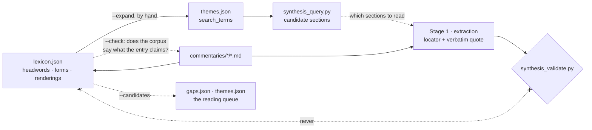

# Term lexicon — design

Why `synthesis/lexicon.json` exists and what it is not allowed to do. For
the pipeline it plugs into see [synthesis-design.md](synthesis-design.md);
for how to run it, [synthesis-operations.md](synthesis-operations.md) §L1–L4;
for what binds an agent editing it, [synthesis/CLAUDE.md](../synthesis/CLAUDE.md).

---

## 1. The problem

The retrieval layer is term search (synthesis-design.md D5), and term
search is only as good as its term list. Today that list is
`themes.json` `search_terms`: eight themes, nine to twenty-five terms
each, all typed by hand.

Two failures follow, and both are silent.

**A missing rendering loses a commentary, not a passage.** The corpus is
English by construction, so a German headword finds almost nothing on its
own — D5 says so. The English renderings are what actually match, and
different commentaries use different ones. `Wesensschau` is glossed
*essence-intuition* in the Derrida commentary, *intuition of essences* in
the *Sein und Zeit* commentary, and *essential intuition* in Hua IX. All
three are in the corpus; `themes.json` has none of them. A `wesen` search
finds the German and misses every place the term is discussed in English.

**A shared rendering merges two terms.** `Besorgen` and `Bekümmerung` are
both rendered *concern* here, one in *Sein und Zeit*, the other in GA 61 —
different terms, different decades, one English word. `Zeitlichkeit` and
`Temporalität` are separated in the corpus by a capital T, which the
matcher lowercases away. Nothing in `themes.json` can express either fact,
so nothing warns the pass that walks into it.

There is a third problem the first two hide: nobody has an inventory.
Eight themes exist because eight themes occurred to someone. `Dasein` has
no theme, and no file anywhere records that this is a choice rather than
an oversight.

## 2. The line

> The lexicon says what to look for and where a rendering was seen. It
> never says what a text claims.

The pipeline's invariant is that every claim about a text carries a
locator and a verbatim quote from a commentary. A lexicon entry is not
that and must never become that: it is compiled from reference works,
translators' habits and the registrar's own reading, which is exactly the
outside knowledge `synthesis/CLAUDE.md` rules 3 and 6 keep out of the
evidence.

So the lexicon sits on the retrieval side of the pipeline, upstream of
the candidate list and nowhere else:

The dotted line back to the commentaries is the part worth noticing. A
rendering can be *attested* — a commentary glossed the term itself, in a
named section, and the entry records where. That is the same move as the
quote check, applied to a dictionary entry, and it is why the file
carries 71 attested renderings out of 349.

## 3. Data model

    lexicon.json
      sources[]   {id, kind, citation, note?}
      entries[]   {id, headword, language, forms[], renderings[],
                   authors?, theme?, contrast_with?, ordinary_english?,
                   gloss?, note?}
        renderings[]  {english, source, translator?, locator?, note?}

One entry per **headword**, not per theme and not per author. Themes are
coarse (eight of them) and are about what a synthesis is *about*;
headwords are what a dictionary indexes and what a search actually needs.
A term several authors use is one entry listing them in `authors`, not
three entries drifting apart.

`theme` is optional, and its absence is the point: an entry with no theme
is a candidate, and `--candidates` ranks those by how much corpus they
touch.

## 4. Design decisions

### L1 · Retrieval, never evidence

Stated above; enforced by construction rather than by instruction. No
script copies lexicon text into an extraction record, `gloss` is capped at
240 characters and documented as non-citable, and the schema gives an
entry nowhere to put a claim. The validator never reads this file, which
is the structural version of the same rule: nothing downstream of
`synthesis_validate.py` can depend on it.

### L2 · Every rendering names a source, and one kind of source is checkable

Four `kind`s, in descending order of what a machine can do with them:

| kind | what it is | verifiable |
|---|---|---|
| `commentary-corpus` | a commentary in this corpus states the pairing | yes — carries a locator, `--check` resolves it |
| `translation` | a named translator's standing rendering | no |
| `dictionary` | a published reference work | no |
| `registry` | a term this repo already asserted elsewhere | no |

For `commentary-corpus` the check has teeth: `--check` resolves the
locator against `corpus.json` and confirms that the section contains
**both** the English and one of the entry's original-language forms. The
second half matters more than the first. Without it an entry could claim
the *Sophist* commentary renders `Sorge` as "care" by pointing at a
section where "care" appears in its ordinary English sense and `Sorge`
never appears at all — which is precisely the confusion gap-004 is about.

The other three kinds are unverifiable by construction. They are marked
rather than blended in, for the reason D4 gives about dates: a corpus that
quietly imports facts from outside has no way to say which facts those
were.

### L3 · `--expand` prints a diff; it does not edit `themes.json`

Widening a theme's search terms is not a merge. Over-inclusion is safe for
a candidate list — a false positive costs a glance — but `absent_terms`
defaults to the theme's search terms, so the same edit changes what a
recorded absence *means*, and D3 makes absences evidence. That is a
judgement, and `themes.json` stays authored (CLAUDE.md rule 8).

So `--expand` reports both directions and stops. Terms the lexicon has and
the theme lacks are commentaries the theme is currently missing. Search
terms with no entry behind them are the reverse question: `leib` searches
for `corps propre`, which fires twice in the whole corpus, and nobody had
a way to notice.

### L4 · Glosses are short, original, and not the dictionary's

`gloss` is capped at 240 characters and is written by the registrar, in
their own words. A reference work's definition text is not copied into
this repo — not into a gloss, not into a note.

This is not squeamishness. The dictionaries are third-party copyrighted
works, and `sync_wordpress.py` globs `commentaries/*/*.md` and publishes on
every push with no draft step (D10). A file in `synthesis/` is one `git mv`
away from a live public page. What belongs here is the part that is not
the book: headwords, forms, renderings, cross-references — with the book
cited in `sources[]` so a reader knows where the compilation came from.

### L5 · Attestation is computed, never stored

Whether a term actually occurs in the corpus is a `--attest` report, not
a field. A stored hit count would go stale against the corpus the moment a
commentary was edited, and this repo already has one staleness mechanism
(D6) whose whole value is that it means something. Same reasoning as D8:
generated facts stay generated.

### L6 · Collisions are warnings, not errors

Two entries sharing an English rendering is a fact about this corpus, not
a mistake — `Besorgen` and `Bekümmerung` really are both "concern" here.
What must not happen is that it goes unrecorded, because a search on the
shared English cannot separate them and an absence claim over it says
nothing about which term is absent. So `--check` warns when two entries
share a rendering and are *not* linked by `contrast_with`: the fix is to
write the collision down, not to delete one of them.

The same applies within an entry: two forms differing only in case search
as one term, because the matcher lowercases. That is worth saying once and
then removing.

### L7 · The corpus is a dictionary too

Every attested rendering in the seed file was mined out of the
commentaries themselves — from their own `English (Original)` glosses —
not typed from a reference work. That was partly discipline and partly
discovery: the mining is what turned up the three renderings of
`Wesensschau` and the `Besorgen`/`Bekümmerung` collision, neither of which
a Heidegger dictionary would have flagged, because both are facts about
*these* commentaries rather than about Heidegger.

A dictionary tells you what renderings exist. The corpus tells you which
ones are in play. Both belong in the file; only the second can be checked.

### L8 · Some forms are recorded and never searched

`ordinary_english` lists forms a search cannot separate from ordinary
English, and `--expand` will not propose them. Two mechanisms, both
common:

- **Homographs.** `Not` is German for distress and English for *not*:
  26,852 whole-word hits in this corpus, none of them Heidegger's word.
  `Interpretation`, `Situation`, `Tradition` and `Negation` are spelled
  identically in both languages.
- **Prefixes.** The matcher is left-anchored (D5), so `Natur` fires
  inside *nature* and *natural* — 5,445 hits, of which 13 are the German
  — `Tod` inside *today*, `Irre` inside *irreducible*, `Wort` inside
  *worth*, `Ontologie` inside the English plural *ontologies*.

The forms stay in `forms`, because they are the term's real forms and an
`--attest` report should still count them. What they must not do is reach
`themes.json`, where `absent_terms` defaults to the theme's search terms
and one such entry makes every absence claim in the theme vacuous. This
is the German-side counterpart of `synthesis/CLAUDE.md` rule 5.

**The field is authored, not computed, and the Dahlstrom import is why.**
The obvious rule — flag a form whose left-anchored count far exceeds its
whole-word count — produced 25 flags of which 12 were wrong. It cannot
tell English contamination from German compounding, and by count they are
identical: `Wissen` exceeds its whole-word total because of
*Wissenschaft*, `Ding` because of *Dinglichkeit*, `Grund` because of
*Grundprobleme*. That over-inclusion is not a defect, it is what the
left-anchored matcher is *for*. Only looking at the words a form actually
fires inside separates the two cases, so `--attest` prints both counts and
flags the divergence neutrally — "fires mostly inside longer words" — and
a person decides which kind it is.

## 5. What the machine cannot check

| Checked | Not checked |
|---|---|
| An attested rendering's section contains both the English and the form | That the rendering is a *good* one |
| Locators resolve; entry ids are unique; themes exist | That the entry's `theme` is the right theme |
| Sources resolve; corpus-sourced renderings carry a locator | That a `dictionary` rendering is really in that dictionary |
| Shared renderings are declared as contrasts | That the contrast is the significant one |
| `ordinary_english` names real forms of the entry | That the forms needing the flag all have it |
| Which registered terms occur in the corpus, and where | Which *unregistered* terms should have been |

The last row is the important one, and it is where the lexicon narrows a
hole rather than closing it. `--attest` names renderings that fire nowhere;
`--expand` names search terms nobody accounted for. Neither can find a
commentary that renders a term of art into ordinary English and never
glosses it — no scan over English text can, and that is exactly what
gap-004 asks about. What the lexicon does is make the answerable part
cheap enough to actually run.

## 6. The reference works

### What is registered

| Source | Kind | Contributes |
|---|---|---|
| `corpus` | the commentaries themselves | 71 renderings, each with a locator, each checked |
| `repo-registry` | `themes.json`, `synthesis_query.py`, `commentaries/CLAUDE.md` | the pre-lexicon seed |
| `dahlstrom-2013` | Dahlstrom, *The Heidegger Dictionary* (Bloomsbury, 2013) | 255 headwords and their renderings |

Only forms, renderings and cross-references are taken. No definition text
is reproduced — not in an entry, not in a note, not in a gloss. The books
stay in [faultynode/sources](https://github.com/faultynode/sources) or
outside git; see L4, and note that `synthesis/` is one `git mv` from a
live public page.

### What the first import taught

Dahlstrom's A–Z headings are `English (German)` and his glossary is a
plain German→English list, so the term equivalences extract cleanly. Four
things did not, and each is now part of the design:

1. **The glossary marks translator divergences.** Dahlstrom flags where
   his rendering differs from the standard translations of *Sein und
   Zeit* — `MR` for Macquarrie-Robinson (1962), `S` for Stambaugh
   (2011). `Befindlichkeit` is his *disposedness*, MR's *state of mind*,
   S's *attunement*; `Verfallen` is *fallenness*, *falling*, *falling
   prey*. Fifteen renderings now carry a `translator`, which is exactly
   what the `vorhandenheit` theme note has been asking for since it was
   written: "English renderings diverge sharply between translations, so
   the search terms must cover both or the English-language commentaries
   drop out of the results."
2. **A dictionary poisons a term list if imported naively.** See L8. Of
   255 headwords, 13 cannot be searched at all.
3. **Collisions arrive in bulk.** Registering 223 new headwords at once
   turned up 26 pairs of German terms that reach English as one word —
   `Auslegung`/`Interpretation` both *interpretation*,
   `Verbergung`/`Verborgenheit` both *concealment*,
   `Differenz`/`Unterschied` both *difference*, `Grund`/`Vernunft` both
   *reason*, `Wille`/`Wollen` both *will*. Each is recorded in
   `contrast_with`, which is what `--check` demands and all it demands:
   the lexicon says the collision exists, and says nothing about which
   term a passage means.
4. **Most of a dictionary is not about this corpus.** 87 of the 255
   headwords occur in no commentary here. They are kept — a term registry
   for an author is a coherent object and a partial import invites a
   confused second one — and they simply rank last in `--candidates`,
   which is where an unregistered headword goes to be noticed.

### Adding the next one

1. Keep the book out of the repo (as above).
2. Add it to `sources[]` with `kind: "dictionary"` and a full citation.
3. Extract headwords, forms and renderings. Nothing else.
4. Mine the corpus for the same headwords — `English (Headword)` glosses
   are attested renderings, and they carry locators `--check` can verify.
   This is what makes an entry worth more than the dictionary page it
   came from (L7).
5. Run `--check`, work the collision warnings into `contrast_with`, and
   run `--attest` over the new entries to decide `ordinary_english` by
   looking at what each form fires inside (L8).
6. `--expand` per theme the batch touches, then `--candidates`.

A dictionary for an author with no commentary in the corpus is still
worth registering. Merleau-Ponty is the live case — named 146 times
across these files and the subject of none of them — and his entries
would rank in `--candidates` on hits from the commentaries that discuss
him, which is the coverage map for the commentary nobody has written.

## 7. Performance

Whole lexicon, 255 entries, against 53 commentaries and 2.9 million words:

| Mode | Time |
|---|---|
| `--expand` | instant (no corpus scan) |
| `--check` | 1.2 s |
| `--candidates` | 5.3 s |
| `--attest`, one theme | under a second |
| `--attest`, everything | 11.7 s |

`--attest` over the whole file counts every registered term against every
document: 33,284 term-document pairs, and 42 s written the obvious way at
a quarter of the current size. The matcher's pattern is a literal with a
left-hand word boundary, so the occurrences can be found with `str.find`
and filtered on the preceding character instead of scanned for with a
regex; cost then tracks how often a term occurs rather than how long the
corpus is, and both boundary tests share one traversal. The result is
identical — checked against `lib.count_terms` over every pair — and the
same trick is available to `synthesis_status.py` if that report ever
outgrows its budget.
