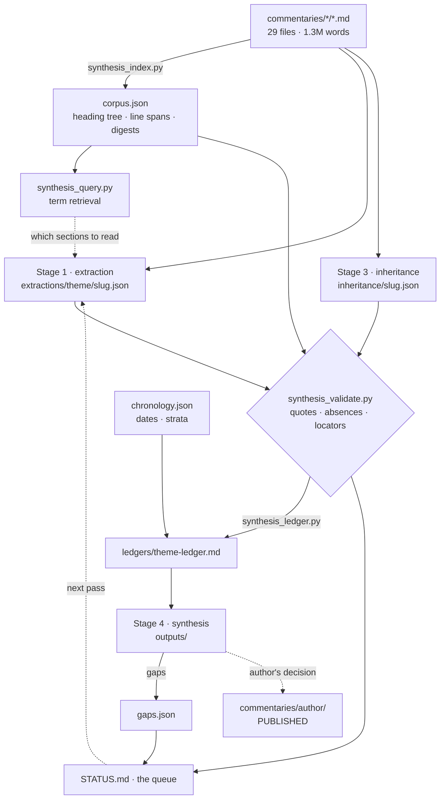

# Synthesis pipeline — design

Why this is built the way it is. For how to run it, see
[OPERATIONS.md](OPERATIONS.md); for the conventions that bind an agent
working in this folder, [CLAUDE.md](CLAUDE.md).

---

## 1. The problem

The commentaries are exhaustive and locally focused by construction: the
[commentary prompt](../prompts/commentary-prompt) requires every native
unit of a text to get its own block at equal depth, in order. That
produces the best possible material for reading *one* work and no
apparatus at all for reading *across* works. Nothing in a commentary
looks sideways at another commentary, and nothing tracks a term through
the corpus.

The corpus is also too large to hand to a model. `corpus.json` counts it:

| | |
|---|---|
| Commentaries | 29 |
| Sections | 2,569 |
| Words | 1,322,667 |

Feeding excerpts of that straight into an essay prompt produces the
failure mode this pipeline exists to prevent — fluent claims with no
textual anchor, indistinguishable at a glance from claims that have one.
The problem is not that a model invents citations; it is that **nothing
in the artifact records which claims were checked**, so the reader must
either re-verify everything or trust everything.

## 2. The invariant

> Every claim about a text carries a locator and a verbatim quote, and a
> script looks the quote up.

One sentence, and everything else follows from it. It is worth more than
any amount of instruction in the prompts, because instructions degrade
silently over a long context and a `grep` does not. It also converts the
reader's problem from *trust* to *audit*: a synthesis assembled from
verified units can be wrong about what a passage means, but it cannot be
wrong about whether the passage exists.

The corollary is the discipline that makes the invariant achievable:
extraction may not interpret, and synthesis may not make new textual
claims. Each stage is denied the other's move, so each stage's output is
checkable in a way a single blended pass would not be.

## 3. Architecture

| Stage | Reads | Writes | Forbidden |
|---|---|---|---|
| 1 Extract | one commentary | `extractions/<theme>/<slug>.json` | interpreting, connecting, reaching past the commentary |
| 2 Collate | extraction records | `ledgers/<theme>-ledger.md` | — (a script; no judgement) |
| 3 Inheritance | one commentary | `inheritance/<slug>.json` | naming a predecessor text the commentary does not name |
| 4 Synthesize | ledgers only | `outputs/`, `gaps.json` | new textual claims, filling gaps |

Stage 2 has no prompt because it needs no judgement, and a stage that
needs no judgement should not be given one. Everything a model could
smooth over while "collating" — dates, order, the difference between a
recorded absence and an unread file — is exactly what must not be
smoothed.

## 4. Data model

Five entity types. Three are hand- or model-authored; two are generated
and may be deleted at any time without loss.

    themes.json ──< extraction record >── corpus.json ──> commentary file
                          │                    ▲
                          │                    │
    chronology.json ──────┴──> ledger          └── inheritance record
         │                       │
         └──> STATUS.md <────────┴──── gaps.json

**Extraction record** — one pass, one commentary, one theme. Carries
`source_sha256` (the digest read against), `coverage`, an array of
`units`, and an array of `absences`. A unit is `{id, locator,
primary_locator?, stratum?, term, status, claim, quote}`.

Three fields are less obvious than they look:

- `status` ∈ {introduced, presupposed, revised, criticized} — what the
  term *does* at that place. This is the column that makes a ledger more
  than a concordance: a chronological list of "presupposed" with one
  "introduced" at the front is a development; the same list without the
  column is a word count.
- `primary_locator` is the citation into the primary text **as the
  commentary gives it** (`GA 20 § 31a`, `Hua IV § 18`). It is never
  synthesized, because the commentary is the only evidence in scope.
- `stratum` points into `chronology.json`, and is set only where the
  commentary assigns the passage to a dated layer.

**Inheritance record** — same shape, engagement-typed: `{predecessor:
{author, text?}, mode, claim, quote}` with `mode` closed over five
values. `text` is omitted rather than inferred when the commentary names
only an author.

**Chronology** — per commentary: `role` ∈ {primary, reception, output},
`status` ∈ {resolved, unresolved}, and an array of dated `strata` each
carrying `stated_in_commentary` and `evidence`.

**Corpus index** (generated) — per commentary: digest, word count, and a
flat section list with `id`, `level`, `title`, `path`, `anchor`,
`line_start`, `line_end`, `words`. 1.9 MB of JSON, rebuilt in ~0.5 s.

**Ledger and STATUS.md** (generated) — pure functions of the above.

## 5. Design decisions

### D1 · The locator is our own id, not the published anchor

`<commentary-slug>#<section-id>`, where the id is minted by
`section_id()`: NFKD, Greek transliterated, `§` → `s`, everything else
hyphenated, prefixed with the heading level.

Three anchor dialects exist over the same files. Kramdown renders GitHub
Pages; python-markdown's `toc` extension renders WordPress; and neither
is stable enough to address by. Kramdown strips every leading non-letter,
so `§ 44. Dasein, Disclosedness, and Truth` and a section titled
`Dasein, Disclosedness, and Truth` collapse to the same anchor — fine for
a URL, useless for an address. Greek headings, which are perhaps half of
GA 19's, collapse to near-nothing under both.

So the locator is ours, and the published anchor is carried separately in
`sections[].anchor` for link building only, with kramdown's `-1`, `-2`
duplicate suffixes emulated. A locator keyed to either published dialect
would break on the other surface.

*Consequence:* section ids embed heading text, so **rewording a heading
changes the locator**. That is a deliberate trade — the alternative,
positional ids like `§44` or line offsets, breaks under insertion, which
is the far more common edit. The digest check turns a reworded heading
into a stale-record report rather than a silent mis-resolution.

### D2 · The quote is the verification primitive

Not the locator. A locator resolving to a real section proves only that
the section exists; the quote proves the claim was read off *that* text.
`normalize_quote` forgives smart quotes, dashes, non-breaking spaces,
emphasis marks and line wrapping — it forgives nothing about wording.

Validated by planting failures rather than by assuming: a fabricated
quote and a false absence claim both fail the build, with the locator and
line range in the message.

### D3 · Absences are records, and checked negatives

`absences[]` carries a locator and `expected_because`. The validator
re-checks each one: if a term claimed absent is in fact present in that
section, the record fails.

This is not symmetry for its own sake. The shape of a concept across a
corpus lives mostly in what is not yet there — the seed pass found
exactly one occurrence of `Sorge` in the whole GA 19 commentary, the
glossary line, against a chapter of it in GA 20 one semester later. A
recorded absence is evidence; ledger silence is not, because it may mean
no pass has run. Hence every ledger ends with **"Not covered by this
ledger"**, computed from term hits in commentaries with no record. Without
that section a reader cannot tell a finding from an unread file, and the
distinction is the whole difference between a result and an artifact of
the queue.

`absent_terms` exists because "care" and "concern" are ordinary English
words: the GA 19 records check the German family only, since the
commentary uses "care" non-technically on the same page.

### D4 · Dates from the commentaries, `unresolved` allowed

Ordering is by composition or delivery date. Volume number is not a
proxy for it, and the corpus contains the standing counterexample: Hua IV
is a 1912 draft, a 1915 rework, two Stein copies, a Landgrebe typescript
and four years of Husserl's insertions — six strata between 1912 and
1928, every one of them stated in that commentary's own editor's
introduction. Dating the volume 1912, or 1952 for its publication,
flattens exactly the development a ledger exists to show.

Nine entries are therefore `unresolved` — seven primary commentaries and
two of reception: their commentary never dates its own text, so they sit
in an undated bucket rather than on a guessed position. This mirrors
[filename-prompt.md](../prompts/filename-prompt.md) §Process step 4 —
never supply a volume number from outside knowledge — and for the same
reason: a corpus that quietly imports facts from a model's memory has no
way to mark which facts those were.

`role: output` exists so a Stage 4 product cannot re-enter as evidence.
That is how a corpus starts citing itself.

### D5 · Retrieval is term search, not embeddings

Candidate sections are found by a word-boundary alternation over the
indexed section spans. No vectors, no index server, no API key.

Embeddings would be the reflex choice and are wrong here. The terms are
known in advance and are technical: `Vorhandenheit`, `Leib`, `retention`,
`ἀλήθεια`. Semantic similarity would blur precisely the distinctions the
corpus is about — `Körper`/`Leib`, `Erschlossenheit`/`Entdecktheit` — and
would answer with a ranked blur when the question is "where does this
word occur". Term search is exact, explicable, has no build step, and
costs a second over 1.3 million words.

Two properties of the matcher matter. Terms are anchored on the left only
(`(?<!\w)care` matches "careful"), which makes it deliberately
over-inclusive: for the candidate heuristic false positives cost a glance,
and for absence checking over-inclusion is conservative in the safe
direction — it fails absence claims it should not, and never passes one it
should have failed. And search terms must include the **English**
renderings, because the commentaries are English by construction; a theme
registered with German terms alone finds almost nothing.

### D6 · Staleness is a digest, and a warning

Each record stores the sha256 of the file it read. When they diverge the
record is stale: its quotes are no longer guaranteed, and quote failures
on that record downgrade from error to warning. The right report for an
edited commentary is "re-extract this", not "you lied about a quote".

`--strict` promotes warnings to errors, for a deliberate audit rather than
for the everyday push that edits a commentary.

### D7 · Standard library only

No `jsonschema`, no `frontmatter`, no `requests` — even though
`sync_wordpress.py` already depends on three of those. Validation that
cannot be run on a bare machine will be run only by CI, which is too
late: the loop is write record → validate → fix, and it must close in
seconds on a laptop with nothing installed.

The cost is about a hundred lines: a flat-YAML frontmatter reader (31)
and `check_schema` (70), a JSON Schema subset covering the keywords the
schemas actually use. The benefit is that the schema files remain the single
statement of the format — the alternative, hand-written Python checks,
duplicates the spec in two places that drift.

### D8 · Generated artifacts are pure functions

No timestamps in `corpus.json`, the ledgers, or `STATUS.md`. A rebuild
that changes nothing produces no diff, therefore no commit, therefore no
CI run, therefore no loop with the WordPress sync. Every generator also
takes `--check`, which is the same computation with an exit code instead
of a write.

### D9 · CI audits; the model never runs in it

Extraction is a scholarly act that wants a human in the loop. A record
generated by a workflow is a record nobody read before it landed, and
non-determinism would make the diff unreviewable. So CI re-checks quotes
and absences on pull requests, and rebuilds derived artifacts on pushes to
`main`. It never writes a claim.

### D10 · The publication seam is a directory

`sync_wordpress.py` globs `commentaries/*/*.md`, exactly one level.
Everything in `synthesis/` is outside that glob, so drafts cannot leak to
a live site. Moving a file into `commentaries/<author>/` **is** the act of
publishing it — there is no draft state in the WordPress sync, and there
is deliberately no automation across this line.

## 6. What the machine cannot check

Stated plainly, because a verification system that oversells itself is
worse than none.

| Checked | Not checked |
|---|---|
| The quote appears in the named section | That the `claim` faithfully paraphrases the quote |
| A claimed absence really is absent | That the absence was worth expecting |
| Locators resolve; ids are unique | That `status` is the right one of the four |
| Records match their schema | That `coverage: complete` was honest |
| Digests match the current file | That the extraction found everything it should |
| Strata and themes referenced exist | That a date is correct, only that it is sourced |

The design responds where it can. `coverage: partial` requires a
`coverage_note` and keeps the record in the queue, so the cheap honest
answer is available. `stated_in_commentary: false` requires `evidence`.
Unit `id`s are stable across re-runs so a re-extraction can be diffed
against its predecessor. But the middle column is a review problem, not a
tooling problem, and the tooling's job is to make the review small enough
to actually do: read the claims beside their quotes in the ledger.

## 7. Extension points

- **New theme** — add to `themes.json` with English renderings in
  `search_terms`; it appears in `STATUS.md` with a ranked candidate list
  immediately.
- **New stage** — add a schema, a validator branch, and a records
  directory. The invariant to preserve: whatever it writes must carry a
  locator and a quote.
- **New output type** — Stage 4 output types are prompt-level, not
  code-level; nothing in the scripts constrains them.
- **Per-unit confidence, reviewer sign-off, cross-commentary unit links**
  — all additive fields; `additionalProperties: false` means the schema
  must be edited first, which is the intended friction.

## 8. Performance

Whole pipeline, 29 commentaries, on one core:

| Step | Time |
|---|---|
| `synthesis_index.py` | 0.5 s |
| `synthesis_validate.py` | 0.5 s |
| `synthesis_query.py` | 1.0 s |
| `synthesis_ledger.py --all` | 1.0 s |
| `synthesis_status.py` | 2.5 s |

`STATUS.md` scans every document once per registered theme, which is the
only step that grows with both axes; whole-file normalization is memoized
and each theme's terms compile to one alternation rather than one pass
per term. Before those two changes the same report took 25 seconds. At
ten times the corpus this remains a seconds-scale problem; if it stops
being one, section-level term counts belong in `corpus.json`.
